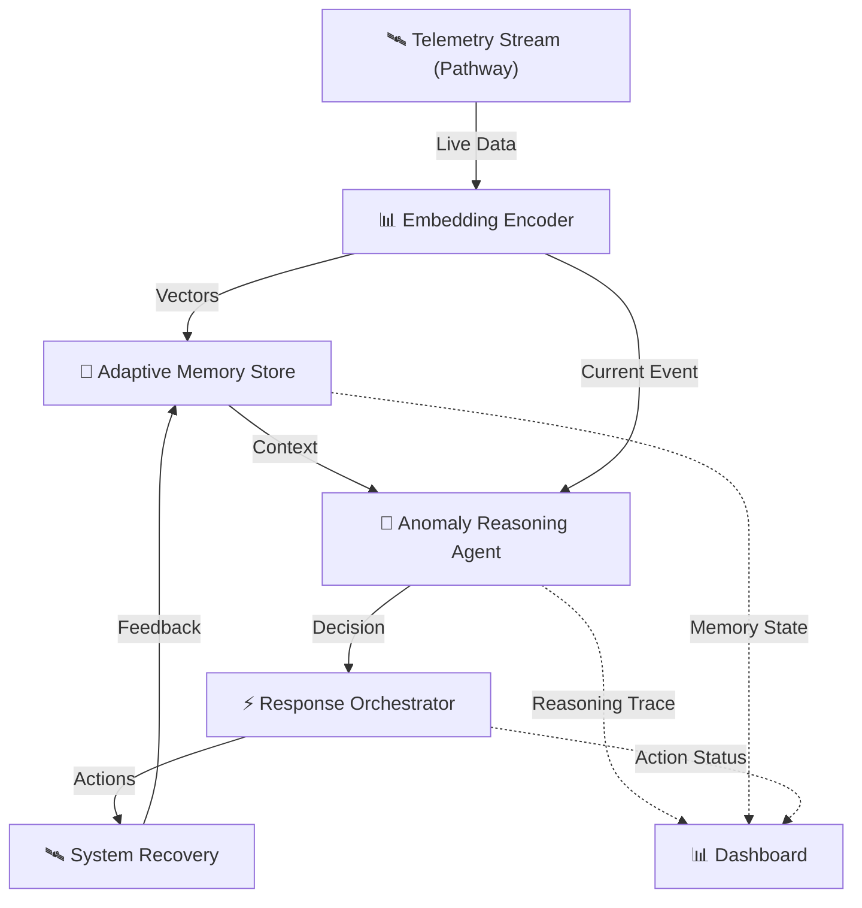

<div align="center">
  

  # AstraGuard AI
  ### ECWoC '26 Featured Project

  <!-- Badges -->
  [](https://elitecoders.xyz)
  [](https://opensource.org/licenses/MIT)
  [](https://www.python.org/)
  [](https://reactjs.org/)
  [](https://nodejs.org/)
  [](https://fastapi.tiangolo.com/)

  <br />

  **[📚 Documentation](docs/TECHNICAL.md)** | **[📄 Technical Report](docs/TECHNICAL_REPORT.md)** | **[🧪 Research Lab](research/)** | **[🐛 Report Bug](.github/ISSUE_TEMPLATE/bug_report.yml)** | **[✨ Request Feature](.github/ISSUE_TEMPLATE/feature_request.yml)**

</div>

---

## 📋 Table of Contents
- [About the Project](#-about-the-project)
- [Project Admin Commitment](#-project-admin-commitment)
- [Key Features](#-key-features)
- [Project Goals](#-project-goals)
- [Tech Stack](#-tech-stack)
- [File Structure](#-file-structure)
- [Contributors Needed](#-looking-for-contributors)
- [Installation](#-installation--setup)

---

## 🚀 About the Project

**AstraGuard AI** is an open-source security-focused system that seamlessly combines **AI-assisted threat detection** with **practical offensive security tooling**.

We bridge the gap between theoretical security concepts and real-world workflows, making it the perfect platform for students, developers, and early security practitioners to:
- 🛡️ **Test** applications against simulated threats.
- 📊 **Analyze** risks with structured data.
- 🧠 **Understand** vulnerabilities through automated reporting.
- 🎓 **Learn** by bridging theory and real security workflows without unnecessary complexity.

The core engine drives the security operations, while our intelligent AI layer handles attack surface analysis, smart payload generation, and guided exploitation (in safe, controlled environments).

**Target Audience**: Primarily learners and early-stage practitioners who want hands-on experience with modern security workflows.

---

## 🏗️ System Architecture




### Modular Architecture


AstraGuard AI is built on a **dual-engine architecture** that separates the heavy lifting of security operations from the intelligence of decision-making.

### 1. 🛡️ Core Security Engine (The Muscle)
*Written in Python*
- **Role**: Executes concrete security tasks.
- **Capabilities**:
    - Packet manipulation (Scapy)
    - Network scanning (Nmap integration)
    - Payload delivery
    - Traffic interception (Burp Suite / Proxy integration)
- **Design**: stateless, robust, and failsafe. It does exactly what it's told, safely.

### 2. 🧠 AI Intelligence Layer (The Brain)
*Written in Python (LangChain/Ollama) & Node.js*
- **Role**: Analyzes context and makes decisions.
- **Capabilities**:
    - **Attack Surface Analysis**: Reads scan data to identify "interesting" targets.
    - **Smart Payload Generation**: Crafts payloads specific to the target stack (e.g., "This looks like an older MongoDB, try these NoSQL injections").
    - **Risk Assessment**: Scores vulnerabilities based on real-world exploitability, not just CVSS.
- **Privacy**: Runs **100% locally** using Ollama (Llama 3 / Mistral), ensuring sensitive scan data never leaves your machine.

---

## 🤝 Project Admin Commitment

As part of **ECWoC '26**, the project admins commit to:

- ❤️ **Maintaining** an active, welcoming project environment.
- ⚡ **Providing** timely reviews and feedback on pull requests.
- 📝 **Creating** and maintaining well-documented issues for contributors.
- 🤝 **Supporting** contributors and mentors throughout the program.
- 📜 **Following** the [ECWoC Code of Conduct](https://elitecoders.xyz/coc).

---

## 🧠 Mentorship & Support

We want to run this project like a real training ground. Our goal isn't just to ship features but to make the contribution process meaningful.

**Our Support Plan:**
- 📚 **Onboarding**: Clear doc + setup guide.
- 🏷️ **Issues**: Pre-written templates with learning notes for context.
- ⚡ **Reviews**: Fast PR reviews (48–72 hrs max).
- 💬 **Communication**: Weekly syncs and active GitHub Discussions support.
- 🎓 **Guidance**: Direct mentorship from maintainers on API design and security logic.

---

## ✨ Key Features

| Feature | Description |
| :--- | :--- |
| **🤖 AI Threat Assistant** | Intelligent analysis of potential vulnerabilities using local LLMs. |
| **🛡️ Offensive Tooling** | A suite of practical security tools for payload generation and testing. |
| **📊 Smart Dashboard** | Real-time visualization of threats and security posture. |
| **🔬 Research Lab** | Integrated lab environment for testing and verifying security hypotheses. |
| **⚡ Real-time Stream** | Powered by Pathway for high-performance data processing. |

---

## 🎯 Project Goals (ECWoC '26)

- ✅ **Build** a stable AI security assistant module for smart vulnerability detection.
- ✅ **Create** well-scoped beginner and intermediate issues for contributors.
- ✅ **Improve** documentation and onboarding flow for new contributors.
- ✅ **Add** automated test pipelines for payload validation and attack surface checks.
- ✅ **Ship** a fully working MVP by the end of the program with measurable test coverage.

---

## 🛠️ Tech Stack

| Component | Technologies |
| :--- | :--- |
| **Frontend** | React, TailwindCSS, Vite |
| **Backend** | Node.js, FastAPI, MongoDB |
| **Security Engine** | Python, Scapy, Nmap, ffuf |
| **AI/ML** | LangChain, Ollama (Local LLMs) |
| **DevOps/Tools** | Docker, GitHub Actions, Burp Suite (Traffic Analysis) |

---

## 📂 File Structure

```text
AstraGuard-AI/
├── .github/                # Issue templates and workflows
├── dashboard/              # React frontend application
├── research/               # 🧪 Research Lab & Theoretical Docs
│   ├── docs/               # Technical architecture specs
│   └── reports/            # Lab reports and findings
├── src/                    # Core source code
│   ├── security_engine/    # Python-based security tools
│   └── ai_agent/           # LLM integration logic
├── tests/                  # Automated test suite
└── README.md               # You are here!
```

---

## 👥 Looking For Contributors

We are looking for **6–10 contributors** for ECWoC '26 to help us build something amazing.

| Role | Count | Focus Area |
| :--- | :---: | :--- |
| **🎨 Frontend** | 3 | React, Dashboard UI, Data Visualization |
| **⚙️ Backend** | 3 | Node.js/FastAPI, API Design, Performance |
| **🛡️ Security** | 2-4 | Python, Lab Testing, Payload Generation |

> **Note**: We value quality over quantity. Contributions should be scoped, clean, and aligned with security best practices. NO random PRs just for streaks.

---

## 📦 Installation & Setup

### Prerequisites
- Python 3.9+
- Node.js 16+
- Git

### Quick Start

1. **Clone the repository**
   ```bash
   git clone https://github.com/sr-857/AstraGuard-AI.git
   cd AstraGuard-AI
   ```

2. **Install Python dependencies**
   ```bash
   pip install -r requirements.txt
   ```

3. **Start the Dashboard**
   ```bash
   streamlit run dashboard/app.py
   ```

---

## 🤝 Contributing

We welcome contributions! Please read our [**Contributing Guidelines**](CONTRIBUTING.md) for details on our code of conduct and the process for submitting pull requests.

---

<div align="center">
  <sub>Part of <b>Elite Coders Winter of Code '26</b></sub><br>
  <sub>Empowering the next generation of open-source contributors through real-world projects and mentorship.</sub>
</div>
