# 🛰️ Synaptix Frontier AI Hack: AstraGuard AI

[](https://opensource.org/licenses/MIT)
[](https://www.python.org/downloads/)
[](https://github.com/psf/black)
[](https://pathway.com/)

> **AstraGuard is a security-first AI system designed to detect threats, analyze intent, and respond intelligently in real time.**

AstraGuard AI is a state-of-the-art autonomous fault detection and recovery system for CubeSats, redesigned for the **Synaptix Frontier AI Hack**. It preserves its core mission: **AI-driven defense with adaptive awareness and memory-efficient decision making**, leveraging **Pathway's** real-time engine and exploring the **Dragon Hatchling (BDH)** architecture.

---

## 🏆 Build-athon: Choose Your Battlefield

Shortlisted teams must submit a proposal describing how they will evolve AstraGuard into a next-generation system under one of the two tracks:

### 🤖 Track 1: Agentic AI (Applied GenAI)
**For teams building real-world systems that could run in production.**
- **Mission:** Evolve AstraGuard into a reactive AI agent system processing live data streams (logs, network events, user activity, alerts).
- **Workflow:** Trigger → Analysis → Decision → Action (including escalation and autonomous containment).
- **Memory Strategy:** Efficient handling of short and long-term context without breaking real-time performance.
- **Tech Stack:** Pathway LLM tooling, Pathway Engine, LangGraph, CrewAI.

### 🧠 Track 2: The Frontier (Research & Deep Tech)
**For teams exploring ideas beyond Transformers, grounded in first-principles thinking.**
- **Mission:** Reimagine AstraGuard using **Dragon Hatchling (BDH)** for biologically-inspired memory updates.
- **Focus:** Theoretical reasoning behind memory dynamics, knowledge retention, and continuous learning.
- **Defense Logic:** Benefits from evolving memory rather than static context windows.
- **Tech Stack:** `pathwaycom/bdh` repository, mathematical intuition, memory flow modeling.

---

## ✨ Key Features

> [!IMPORTANT]
> The security core of AstraGuard remains recognizable: threat detection, reasoning, and intelligent response.

| Component | Description |
|-----------|-------------|
| **🛰️ Real-time Telemetry** | High-frequency data ingestion using Pathway Engine |
| **🧠 BDH Architecture** | Sparse activation and biological memory dynamics |
| **🤖 Agentic Recovery** | Reactive AI agents for autonomous containment and mitigation |
| **🌌 Glassmorphism UI** | Premium Cyber-Noir dashboard for mission control |
| **📝 Adaptive Awareness** | Memory-efficient decision making for real-time defense |

---

## 🏗️ System Architecture

```mermaid
graph TD
    A["🛰️ Telemetry & Event Stream (Pathway)"] -->|Live Data| B["🧠 BDH Anomaly Detector"]
    B -->|Sparse Activation| C["🤖 Agentic Fault Classifier"]
    C -->|Trigger Analysis| D["⚡ Autonomous State Engine"]
    D -->|Containment Actions| E["🛰️ System Recovery"]
    
    subgraph "Frontier Layer"
        B
        C
    end
    
    A -->|Live Feed| F["📊 Mission Dashboard"]
    B -->|Neural Activity| F
    D -->|Decision Flow| F
```



---

## 🚀 Getting Started

### Prerequisites
- Python 3.9+
- `pip` & `git`

### Installation
```bash
git clone https://github.com/sr-857/AstraGuard.git
cd AstraGuard
pip install -e .
```

### Launch Mission Control
```bash
python cli.py dashboard
```
> [!TIP]
> Enable **Frontier Mode** in the dashboard to visualize the BDH neural activity and adaptive memory flow!

---

## 📚 Resources & Learning

> [!NOTE]
> Evaluation focuses on system design quality, technical articulation, and alignment with track goals.

- 📖 [Pathway Documentation](https://pathway.com/docs)
- 🐉 [Dragon Hatchling (BDH) Research](https://github.com/pathwaycom/bdh)
- 🛠️ [LLM App Framework](https://github.com/pathwaycom/llm-app)
- 📄 [AstraGuard AI Technical Report](/report/AstraGuard%20AI_%20Autonomous%20Fault%20Detection%20&%20Recovery%20for%20Small%20Satellites.pdf)

---

## 🔧 Configuration & Customization

### Defense Thresholds
Adjust sensitivity in `classifier/fault_classifier.py`:
- **Voltage**: < 7.3V (Power Threat)
- **Temperature**: > 32°C (Thermal Threat)
- **Gyro**: > 0.05 rad/s (Attitude Threat)

### BDH Parameters
Modify sparse activation and memory dynamics in `anomaly/anomaly_detector.py`.

---

## 🤝 Contributing
Join the revolution! Fork, branch, and submit a PR. Follow PEP 8 and include type hints.

## 📄 License
MIT License - see [LICENSE](LICENSE).

---

**AstraGuard AI** | *Protecting the future of space with intelligent autonomy.* 🛰️✨