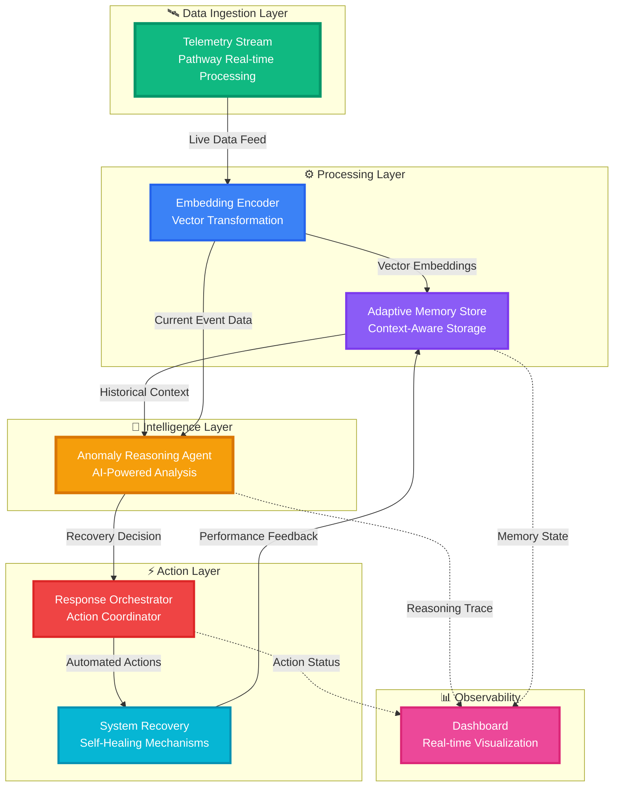

# 🏗️ AstraGuard AI Architecture

This page contains the detailed architecture and component specifications extracted from the project `README.md`.

- Back to hub: [`README.md`](../README.md)

---

## 🏗️ System Architecture

<div align="center">


</div>

### 📊 Architecture Overview

AstraGuard AI implements a sophisticated, event-driven architecture for real-time satellite telemetry monitoring and autonomous anomaly recovery. The system leverages vector embeddings, adaptive memory, and AI-powered reasoning to provide intelligent, self-healing capabilities.



### 🔧 Core Components

#### 🛰️ **Telemetry Stream (Pathway)**

**Purpose**: Real-time data ingestion and stream processing

**Key Features**:
- Continuous satellite telemetry monitoring
- High-throughput data streaming (1000+ events/sec)
- Protocol support: MQTT, WebSocket, gRPC
- Fault-tolerant message queuing

**Technologies**:
- Pathway for real-time streaming
- Apache Kafka for message brokering
- Protocol Buffers for serialization

```python
# Example: Telemetry ingestion
stream = pathway.io.kafka.read(
    topic="satellite-telemetry",
    schema=TelemetrySchema,
    autocommit_duration_ms=1000
)
```

#### 📊 **Embedding Encoder**

**Purpose**: Transform raw telemetry into semantic vector representations

**Key Features**:
- Multi-modal embedding (numerical, categorical, temporal)
- Dimensionality: 768-dimensional vectors
- Context-aware encoding with attention mechanisms
- Real-time transformation (<10ms latency)

**Technologies**:
- Sentence Transformers
- Custom trained embeddings on satellite data
- FAISS for vector indexing

```python
# Vector transformation
embeddings = encoder.encode(
    telemetry_data,
    normalize=True,
    batch_size=32
)

# Index for similarity search
index.add(embeddings)
```

### Dual-Engine Design

#### 1. 🛡️ Core Security Engine (The Muscle)

**Technology**: Python 3.9+  
**Purpose**: Executes concrete security operations

**Capabilities**:
- **Packet Manipulation**: Uses Scapy for deep packet inspection and crafting
- **Network Scanning**: Integrates with Nmap for port scanning and service detection
- **Payload Delivery**: Automated injection and testing of security payloads
- **Traffic Interception**: Proxy integration with Burp Suite for man-in-the-middle analysis
- **Protocol Analysis**: Deep inspection of network protocols and data streams

**Design Philosophy**:
- Stateless and robust
- Fail-safe by default
- Does exactly what it's told—no surprises
- Comprehensive logging for audit trails

#### 2. 🧠 AI Intelligence Layer (The Brain)

**Technology**: Python (LangChain/Ollama) + Node.js  
**Purpose**: Analyzes context and makes intelligent decisions

**Capabilities**:

**A. Attack Surface Analysis**
- Reads scan data from the Security Engine
- Identifies "interesting" targets based on service versions, port configurations, and legacy protocols
- Prioritizes targets by exploitability

**B. Smart Payload Generation**
- Crafts payloads specific to the target technology stack
- Adapts to application framework (Django, Flask, Express, etc.)
- Considers defense mechanisms detected during reconnaissance

**C. Risk Assessment**
- Scores vulnerabilities based on real-world exploitability
- Considers attack complexity, available exploits, and mission objectives

**D. Contextual Decision Making**
- Uses historical anomaly patterns from Adaptive Memory Store
- Adjusts responses based on mission phase
- Learns from previous incidents to improve detection

**Privacy Guarantee**:
- **100% Local Processing**: All AI models run via Ollama on your machine
- **No Cloud Calls**: Sensitive scan data never leaves your infrastructure
- **Offline Capable**: Works without internet connection
- **Audit Trail**: All AI decisions are logged with reasoning traces

### Data Flow

1. **Telemetry Ingestion**: Satellite telemetry streams into the system via Pathway
2. **Encoding**: Data is embedded into vector representations for semantic analysis
3. **Memory Storage**: Historical context is stored in the Adaptive Memory Store
4. **Anomaly Detection**: AI agent analyzes current data against historical patterns
5. **Policy Evaluation**: Mission phase policies determine appropriate response
6. **Action Orchestration**: Response orchestrator executes recovery actions
7. **Feedback Loop**: Action results feed back into memory for continuous learning
8. **Dashboard Update**: Real-time updates pushed to monitoring interface

